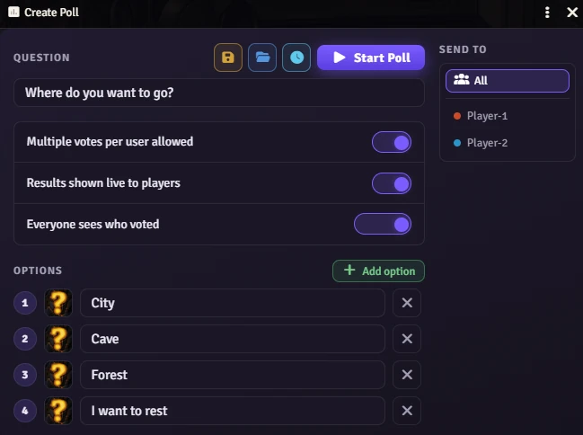
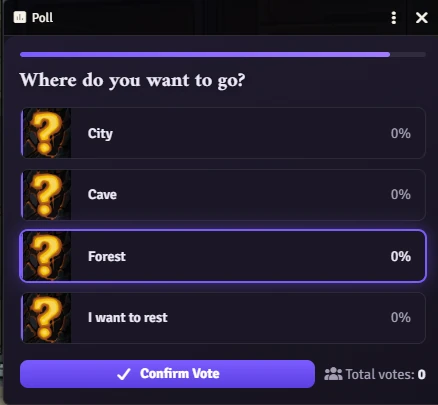
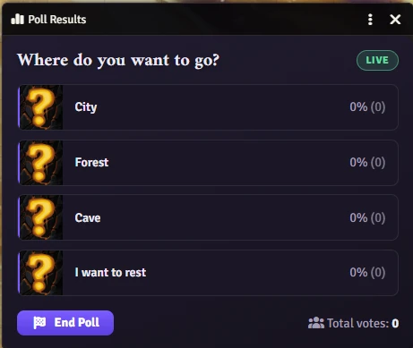
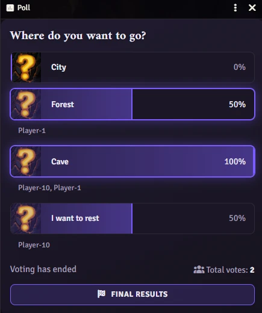
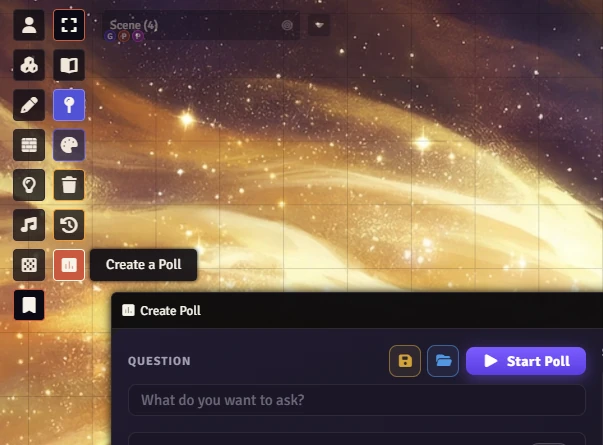

# Visual Polls

**Run live, visual votes at your table — right inside Foundry VTT.**

Compose a question, add answer options, and broadcast it to every player at once. A polished voting window opens on their screens automatically. Results animate in real time as votes come in. No menus to hunt through, no extra setup.

[](https://buymeacoffee.com/mestredigital)

---

## What it looks like

<table>
<tr>
<td align="center" width="50%">
<br/>
<sub><b>Compose your poll</b> — question, options, and images</sub>
</td>
<td align="center" width="50%">
<br/>
<sub><b>Players vote</b> — a clean, focused template opens for everyone</sub>
</td>
</tr>
<tr>
<td align="center" width="50%">
<br/>
<sub><b>GM monitor</b> — watch the tally live, end the poll at any time</sub>
</td>
<td align="center" width="50%">
<br/>
<sub><b>Final results</b> — revealed to players when the GM closes the poll</sub>
</td>
</tr>
</table>

---

## Features

### For the GM
- **Poll creator** — Write a question, add two or more answer options, and assign an image to each one.
- **Flexible settings per poll** — Toggle multiple-choice voting, choose whether players see live results while voting, and control voter name visibility (hidden, GM-only, or visible to everyone).
- **Target specific players** — Send the poll to all connected players or pick individuals from the list.
- **Saved templates** — Save any poll as a reusable template and load it again in seconds.
- **Live results monitor** — A dedicated GM window shows the running tally in real time, even when player-facing results are hidden.
- **Countdown timer** — Optionally set a duration in seconds via the clock icon in the creator toolbar. A progress bar depletes in real time on both the GM monitor and every player's screen. When the timer runs out the poll closes automatically: if live results were enabled the final tally is revealed immediately; otherwise the GM can still decide whether to share the results.
- **Full control** — End the poll at any time to freeze the final result, or clear it entirely to start fresh.

### For players
- **Automatic delivery** — The voting window opens on every targeted player's screen the moment the GM starts the poll.
- **Option images** — Each answer card can display a custom image alongside the text.
- **Multi-choice support** — When enabled, players can pick more than one option before confirming.
- **Live progress bars** — Animated bars and percentages update as votes arrive (when the GM enables it).
- **One vote, locked in** — After confirming, controls disable so there's no accidental double voting.
- **Late-join support** — A player who reconnects mid-poll receives the current poll state immediately.

### Sound & polish
- **Built-in sound effects** — Hover, select, confirm, and final-results sounds with separate win / tie / failure cues.
- **Fully customizable audio** — A dedicated settings panel lets you adjust the master volume, toggle individual sounds on or off, and swap in your own audio files.


<sub>Access the poll creator from the canvas toolbar (Notes layer) or via macro.</sub>

---

## How to run a poll

1. Click the **poll icon** in the Notes toolbar on the canvas, or run `VisualPolls.openCreator()` in a macro.
2. Type your question and fill in at least two options. Give each one an image if you like.
3. Choose your settings: multiple choice, live results, voter visibility, target players. Optionally click the **clock icon** to set a countdown timer in seconds.
4. Click **Start Poll** — the voting window opens on every targeted player's screen simultaneously.
5. Watch the live tally in your GM monitor as votes arrive.
6. Click **End Poll** to freeze the final result and reveal it to players.
7. Click **New Poll** to clear everything and start the next one.

---

## Public API

Available after the `ready` hook. Useful for macros and module integrations.

[API Reference](https://github.com/brunocalado/visual-polls/wiki/API-Reference)

---

## Installation

1. Open Foundry VTT and go to **Add-on Modules**.
2. Click **Install Module**.
3. Paste the manifest URL below and click **Install**.

```
https://raw.githubusercontent.com/brunocalado/visual-polls/main/module.json
```

4. Enable the module in your world via **Manage Modules**.

---

## Bug Reports & Feature Requests

https://github.com/brunocalado/visual-polls/issues

---

## Credits and License

* This module is released under this [LICENSE](LICENSE).

* [selected-option.ogg](https://pixabay.com/sound-effects/technology-bell1-445873/)

* [hover.ogg](https://pixabay.com/sound-effects/film-special-effects-minimalist-button-hover-sound-effect-399749/)

* [final-results-win.ogg](https://pixabay.com/sound-effects/musical-winbrass-39632/)

* [confirm-vote.ogg](https://pixabay.com/sound-effects/film-special-effects-simple-notification-152054/)

* [final-results-failure.ogg](https://pixabay.com/sound-effects/film-special-effects-echec-370391/)

* [final-results-tie.ogg](https://pixabay.com/sound-effects/people-female-voice-oh-no-498457/)
